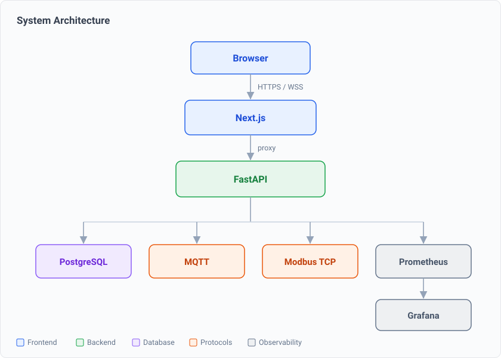
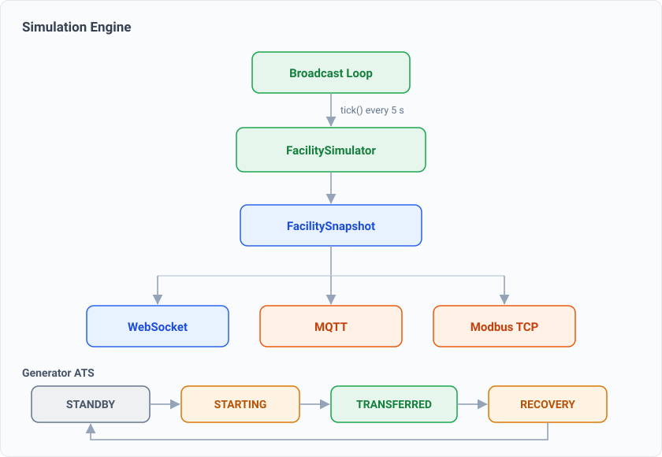
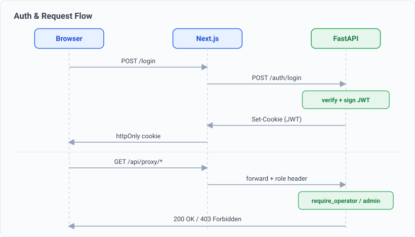

# DC-NORTH-01 — Data Center Digital Twin

A real-time digital twin of a data center. It simulates the physical behaviour of the
electrical and cooling plant, publishes that state over the same industrial protocols real
hardware uses (Modbus TCP, MQTT), and drives a live operator dashboard where you can watch
the facility, inject faults, and work the alarms — all without a single piece of physical
equipment.

The goal was to build the kind of monitoring platform that sits in a real data center NOC,
end to end: a physics model at the bottom, industrial protocols in the middle, and a
production-grade operator UI on top — and to make every layer open and replaceable instead
of a black box.

---

## What it is

Real facilities run on SCADA and building-management systems that are closed, expensive, and
impossible to experiment with. DC-NORTH-01 reproduces that world in software:

- A **physics simulation** models power flow, cooling, and the generator transfer sequence of
  a Tier-style facility (two data halls, UPS bank, PDUs, CRAH units, a standby generator).
- The live state is exposed over **Modbus TCP** and **MQTT** — the exact interfaces a real
  UPS, PDU, or meter speaks — so any SCADA tool or Modbus master can read it with no custom
  integration.
- A **FastAPI** backend turns that state into a REST + WebSocket API, evaluates alarms, and
  exposes Prometheus metrics.
- A **Next.js** operator dashboard shows PUE, load, per-hall cooling, equipment health, the
  single-line diagram, and the alarm feed — updating live over one WebSocket.

Because the simulation and the real-hardware interface sit behind the same output contract,
swapping the simulator for real sensors is an implementation detail, not a rewrite.

---

## Architecture



The browser talks only to Next.js. Next.js proxies every call to FastAPI over an internal
network, so there is one origin, no CORS surface, and the backend is never exposed directly.
FastAPI owns the simulation, persistence, alarm engine, and the protocol gateways.

---

## The simulation engine



A background loop calls `FacilitySimulator.tick()` every five seconds. One tick advances the
whole facility — electrical load, thermal behaviour per hall, UPS and generator state — and
returns a single typed `FacilitySnapshot`. That one object is the contract: the WebSocket
broadcast, the MQTT publisher, the Modbus register map, and the alarm evaluator all read from
it, so nothing can drift out of sync.

The generator runs a real **automatic transfer switch (ATS)** state machine. On a utility
loss it walks `STANDBY → STARTING → TRANSFERRED → RECOVERY → STANDBY` with realistic timing,
and cooling is isolated per hall, so a CRAH trip in Hall A degrades Hall A only.

### Fault scenarios

Faults can be injected live from the dashboard (or the API) and clear the same way:

| Scenario | What it does |
|---|---|
| **Utility loss** | Mains fails, UPS carries the load, generator auto-starts and transfers |
| **CRAH trip** | A cooling unit drops, inlet temperatures in that hall climb, a thermal alarm raises |
| **Rack overload** | Extra compute load raises power draw and heat, cascading through both models |
| **Generator fail** | The standby generator fails to carry, exposing the UPS runtime limit |

Each fault propagates through the physics, shows up in the KPIs, trips the right alarms, and
is visible in the single-line diagram — the same chain of cause and effect an operator would
see for real.

---

## Sensors and devices

The facility is instrumented the way a real one is — electrical, environmental, cooling, and
safety points across both halls and the plant rooms:

| Sensor | Unit | Protocol | Category |
|---|---|---|---|
| Rack inlet / outlet temperature | °C | SNMP / Modbus | Temperature |
| Ambient temperature | °C | SNMP / Modbus | Temperature |
| Relative humidity | % | SNMP / Modbus | Environment |
| Power draw | kW | Modbus | Electrical |
| Phase current | A | Modbus | Electrical |
| Voltage | V | Modbus | Electrical |
| Airflow | CFM | SNMP | Cooling |
| UPS battery | % | SNMP | Power |
| Smoke detector | — | Digital I/O | Safety |
| Water-leak detector | — | Digital I/O | Safety |
| Door contact | — | Digital I/O | Access |

Electrical meters are exposed as **Modbus TCP** slaves with a fixed 6-register layout
(voltage, current, power, energy, power factor, frequency). Environmental and power points
also publish over **MQTT**, and the dashboard reads SNMP-style status for UPS and cooling.

---

## Authentication and roles



Login signs a JWT and stores it in an `httpOnly` cookie — not `localStorage`, so it is not
reachable from JavaScript. Every protected call is proxied with the user's role, and the
backend enforces it: `OPERATOR` can acknowledge alarms and issue control commands, `ADMIN`
additionally manages users and clears alarms. Control endpoints are role-gated server-side,
not just hidden in the UI.

---

## Tech stack

| Layer | Technology |
|---|---|
| Frontend | Next.js 16 (App Router), React 19, TypeScript, Recharts |
| Backend | FastAPI, Python 3.13, async SQLAlchemy |
| Database | PostgreSQL 16 |
| Protocols | Modbus TCP, MQTT (Mosquitto), SNMP, WebSocket |
| Simulation | Pure-Python physics engine, typed snapshot contract |
| Auth | JWT (`httpOnly` cookie), bcrypt, role-based access |
| Observability | Prometheus metrics + Grafana dashboards |
| Infrastructure | Docker Compose, Terraform (EC2 + ECS Fargate), Kubernetes manifests |
| Quality | Playwright E2E, GitHub Actions CI (4 parallel jobs) |
| PWA | Installable, offline-capable operator app |

---

## Quick start

Requirements: Docker and Docker Compose.

```bash
cp .env.example .env
# set JWT_SECRET to a long random string before starting
make up
```

| Service | URL |
|---|---|
| Dashboard | http://localhost:3000 |
| API docs | http://localhost:8000/docs |
| Grafana | http://localhost:3001 |
| Prometheus | http://localhost:9090 |
| Modbus TCP | localhost:5020 |

Frontend-only development:

```bash
cd apps/web
npm install
npm run dev
```

---

## Repository layout

```
apps/web/            Next.js dashboard
services/api/        FastAPI backend — REST, WebSocket, Modbus, alarms
services/simulation/ Sensor simulators
simulation/          Facility physics engine + facility model (YAML)
packages/types/      Shared TypeScript contracts (@dctwin/types)
config/              Device register profiles, Mosquitto config
infrastructure/      Prometheus + Grafana provisioning
infra/terraform/     ECS Fargate
deploy/              EC2 bootstrap + DEPLOY.md
k8s/                 Kubernetes manifests
docs/                Architecture decision records + diagrams
```

---

## Deployment

A full step-by-step cloud deployment guide lives in [`deploy/DEPLOY.md`](deploy/DEPLOY.md).
The repository ships Terraform for AWS EC2 and ECS Fargate, Kubernetes manifests, and a
production Docker Compose overlay.

---

## Design decisions

The reasoning behind each major choice — the monorepo, WebSocket over SSE, the pure-Python
tick, and the Modbus register layout — is written up as Architecture Decision Records in
[`docs/adr/`](docs/adr/).

---

## Author

**Faryan Rajabi** — frontend & dashboard engineer, MSc student at Politecnico di Torino.

- LinkedIn: [linkedin.com/in/faryan-rajabi](https://www.linkedin.com/in/faryan-rajabi)
- GitHub: [github.com/faryanra](https://github.com/faryanra)

---

## License

Released under the MIT License. See [`LICENSE`](LICENSE) for the full text.

© 2026 Faryan Rajabi.
